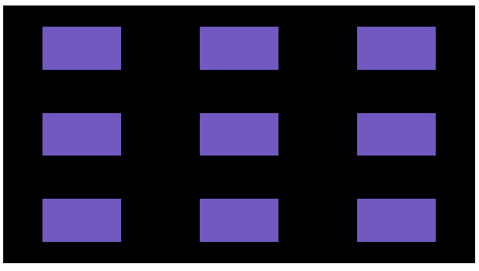
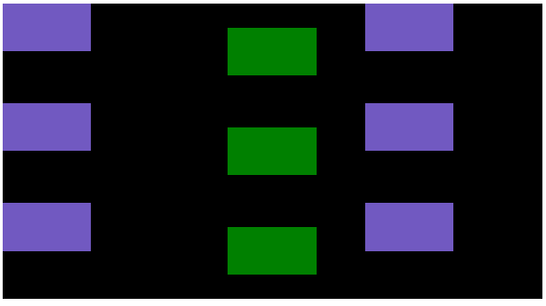
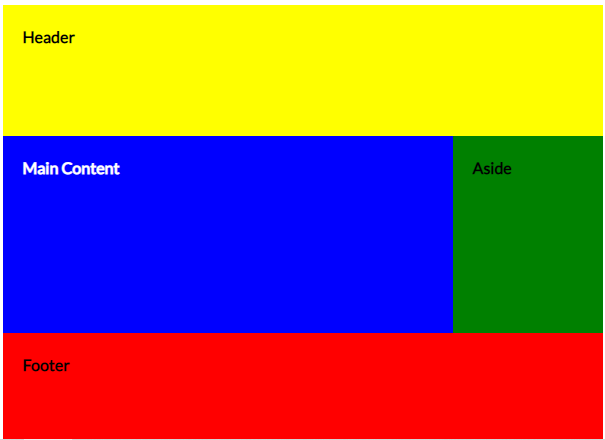

<h1>Desvendando o CSS-GRID</h1>

O Grid do CSS é uma técnica que permite criar layouts responsivos por meio do alinhamento de conteúdos e elementos em uma página HTML. Ele utiliza o método de linhas e colunas, onde podemos até definir regiões onde nossos elementos estarão na página. De início é importante manter em mente que o significado de dois termos:

Justify: utilizamos para alinhamento horizontal (eixo x).<br>
Align: utilizamos para alinhamento vertical (eixo y).


<h2>Alinhamento de Itens</h2>
<p>Aqui estamos utilizando um grid com 3 linhas em 3 colunas, onde cada todos os item são alinhados juntos, nesse caso, ao centro de sua respectiva célula. Pra isso utilizamos o 'justify/align-items'.</p>

###  CSS     
```css
.container {
    display: grid;
    grid-template: 1fr 1fr 1fr / 1fr 1fr 1fr ;
    align-items: center;
    justify-items: center;
    /* Podemos usar 4 valores: start, end, center, stretch */
}
```

### HTML
```html
<div class="container">
    <div></div>
    <div></div>
    <div></div>
    <div></div>
    <div></div>
    <div></div>
    <div></div>
    <div></div>
    <div></div>
</div>
```




<h2>Alinhamento Self</h2>
<p>Aqui temos um grid também com 3 linhas e 3 colunas, mas podemos trabalhar **individualmente** no alinhamento de itens. Basta setar o 'align/justify-self' no elemento filho do container que eu quero alinhar. No exemplo abaixo, os items em verde estão recebendo a classe 'center' que contém os alinhamentos ao centro. </p>

###  CSS    
```css
.container{
    display: grid;
    grid-template: 1fr 1fr 1fr / 1fr 1fr 1fr;
}

.center {
    align-self: center;
    justify-self: center;
    background-color: green;
}

```

### HTML
```html

<div class="container">
    <div></div>
    <div class="center"></div>
    <div></div>
    <div></div>
    <div class="center"></div>
    <div></div>
    <div></div>
    <div class="center"></div>
    <div></div>
</div>
```


<h2>Alinhamento de Content</h2>
<p>Aqui temos um grid também com 3 linhas e 3 colunas, mas podemos trabalhar no alinhamento do próprio grid, utilizando o 'justify/align-content'.</p>

<p>O uso dessas propriedades são raras, pois só é aplicado caso o grid seja menor que a area definida. (Por exemplo, quando usamos em px o tamanho do grid, poderemos terminar com um grid pequeno, para o tamanho da area do grid)</p>

###  CSS   
```css
.container{
    display: grid;
    grid-template: 10px 10px 10px / 10px 10px 10px;
    align-content: center;
    justify-content: center;
    /* Podemos usar 7 valores: start, end, strech, space-between, space-around, space-evenly. */  
}
 ```
### HTML
```html
<div class="container">
    <div></div>
    <div></div>
    <div></div>
    <div></div>
    <div></div>
    <div></div>
    <div></div>
    <div></div>
    <div></div>
</div>
```


<section>
<h2>Alinhamento por Template</h2>
<p>Por meio do grid-template-areas podemos alinhar os elementos onde quisermos dentro de um container.</p>

```css
.container{
    display: grid;
    grid-template: 20vh 30vh 10vh / 3fr 1fr;

    grid-template-areas:
    "header header"
    "main aside"
    "footer footer";
}
```

<p>E para cada item eu defino, o nome com o 'grid-area'</p>

```css
header  {background: yellow; grid-area: header}
main    {background: blue; grid-area: main}
aside   {background: green; grid-area: aside}
footer  {background: red; grid-area: footer}
```

### HTML
```html
<div class="container-4">
    <header>Header</header>
    <main>Main Content</main>
    <aside>Aside</aside>
    <footer>Footer</footer>
</div>
```



